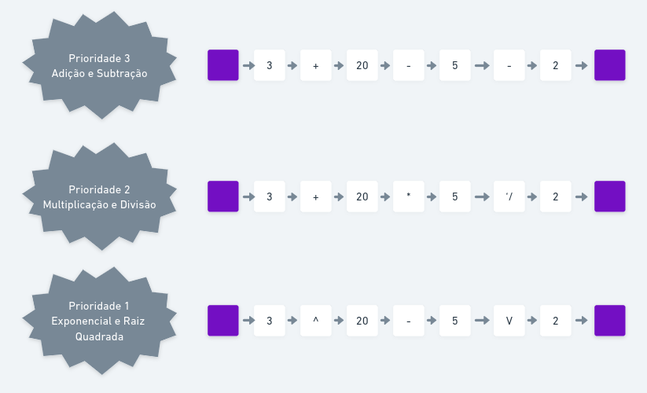

# Calculadora Funcional

**Disciplina**: FGA0210 - PARADIGMAS DE PROGRAMAÇÃO - T01 <br>
**Nro do Grupo**: 04<br>
**Paradigma**: Funcional<br>

## Alunos
| Matrícula  | Aluno                                    |
| ---------- | ---------------------------------------- |
| 19/0124997 | Amanda Jeniffer Pereira Nobre            |
| 19/0101792 | Ana Carolina Rodrigues Leite             |
| 17/0101711 | Daniel Barcelos Moreira                  |
| 16/0119006 | Enzo Gabriel Guedes Queiroz Saraiva      |
| 18/0018604 | Hugo Sobral de Lima Salomão              |
| 18/0102711 | Jaime Juan de Castro Feliciano Damasceno |
| 18/0021974 | Leonardo da Silva Gomes                  |
| 17/0111288 | Micaella Lorraine Gouveia de Lima        |

## Sobre 
O projeto consiste em uma calculadora funcional que tem a capacidade de ler expressões matemáticas e imprimir o resultado via terminal.
Embora seu funcionamento pareça simples, a implementação desta aplicação se assemelha muito mais a um analisador léxico, dando a oportunidade de fazer a leitura de uma string como expressão, e realizar as devidas operações com as prioridades matemáticas respeitadas.

A calculadora abrange as seguintes expressões:
- Adição
- Subtração
- Multiplicação
- Divisão
- Exponencial


A calculadora atende os seguintes casos de prioridade de operação:


## Screenshots
Adicione 2 ou mais screenshots do projeto em termos de interface e/ou funcionamento.

## Instalação 
**Linguagens**: Haskell<br>
**Tecnologias**: Haskell Tool Stack e Cabal em ambiente containerizado por Docker<br>

Este projeto conta como dependências as ferramentas [Stack](https://docs.haskellstack.org/en/stable/) e [Cabal](https://cabal.readthedocs.io/en/stable/) providas pela própia linguagem em conjunto com o [GHCup](https://www.haskell.org/ghcup/).

Entretanto, existe uma certa incerteza entre plataformas, visto que o suporte à estas ferramentas não são uniformes entre diferentes sistemas operacionais. Para tal, foi desenvolvido então uma imagem para executar o projeto.

Para executar o projeto, é preciso ter o [Docker](https://docs.docker.com/) instalado localmente, caso você não ainda não tenha, baste seguir a [documentação de instalação da ferramenta](https://docs.docker.com/).

Com o docker instalado, basta executar o seguinte comando em um terminal, localizado na mesma pasta que o arquivo `Dockerfile`:

```
docker build -t g4_funcional_calculadora .
```

Uma vez executado o comando de `build`, é necessário então instanciar um container a partir da imagem. É possível realizar isso com o comando:

```
docker run -it --name calculadora g4_funcional_calculadora
```

Para executar o container parado, então, basta executar o seguinte comando:

```
docker start -a calculadora
```

> Gifs animados e outras ilustrações são bem-vindos!

## Uso 
Explique como usar seu projeto.
Procure ilustrar em passos, com apoio de telas do software, seja com base na interface gráfica, seja com base no terminal.
Nessa seção, deve-se revelar de forma clara sobre o funcionamento do software.

## Vídeo
Adicione 1 ou mais vídeos com a execução do projeto.
Procure: 
(i) Introduzir o projeto;
(ii) Mostrar passo a passo o código, explicando-o, e deixando claro o que é de terceiros, e o que é contribuição real da equipe;
(iii) Apresentar particularidades do Paradigma, da Linguagem, e das Tecnologias, e
(iV) Apresentar lições aprendidas, contribuições, pendências, e ideias para trabalhos futuros.
OBS: TODOS DEVEM PARTICIPAR, CONFERINDO PONTOS DE VISTA.
TEMPO: +/- 15min

## Participações
| Nome do Membro                           | Contribuição                                         | Significância da Contribuição para o Projeto (Excelente/Boa/Regular/Ruim/Nula) |
| ---------------------------------------- | ---------------------------------------------------- | ------------------------------------------------------------------------------ |
| Fulano                                   | Programação dos Fatos da Base de Conhecimento Lógica | Boa                                                                            |
| Amanda Jeniffer Pereira Nobre            | -                                                    | Boa                                                                            |
| Ana Carolina Rodrigues Leite             | -                                                    | -                                                                              |
| Daniel Barcelos Moreira                  | -                                                    | -                                                                              |
| Enzo Gabriel Guedes Queiroz Saraiva      | -                                                    | -                                                                              |
| Hugo Sobral de Lima Salomão              | -                                                    | -                                                                              |
| Jaime Juan de Castro Feliciano Damasceno | -                                                    | -                                                                              |
| Leonardo da Silva Gomes                  | -                                                    | -                                                                             |
| Micaella Lorraine Gouveia de Lima        | -                                                    | -                                                                              |

## Outros 
Quaisquer outras informações sobre o projeto podem ser descritas aqui. Não esqueça, entretanto, de informar sobre:
(i) Lições Aprendidas;
(ii) Percepções;
(iii) Contribuições e Fragilidades, e
(iV) Trabalhos Futuros.

## Fontes
Aqui estão listadas as fontes ou links relevantes utilizados para a codificação do projeto.

> https://www.tutorialspoint.com/haskell/haskell_functions.htm. Acesso em 21/11/2022.
> https://github.com/JudsonSS/Compiladores Acesso em 19/11/2022.  
> https://www.youtube.com/watch?v=nckWiHmeNXU Acesso em 19/11/2022.  
> https://hackage.haskell.org/package/base-4.17.0.0/docs/Data-Char.html Acesso em 22/11/2022.     
> https://hub.docker.com/_/haskell Acesso em 19/11/2022.      
> https://hackage.haskell.org/package/base-4.17.0.0/docs/System-Exit.html Acesso em 23/11/2022.
> https://stackoverflow.com/questions/25457287/couldnt-match-type-maybe-with-io-expected-type-io-string-actual-type-may Acesso em 23/11/2022.  
> https://stackoverflow.com/questions/48177824/how-does-return-statement-work-in-haskell Acesso em 23/11/2022.
