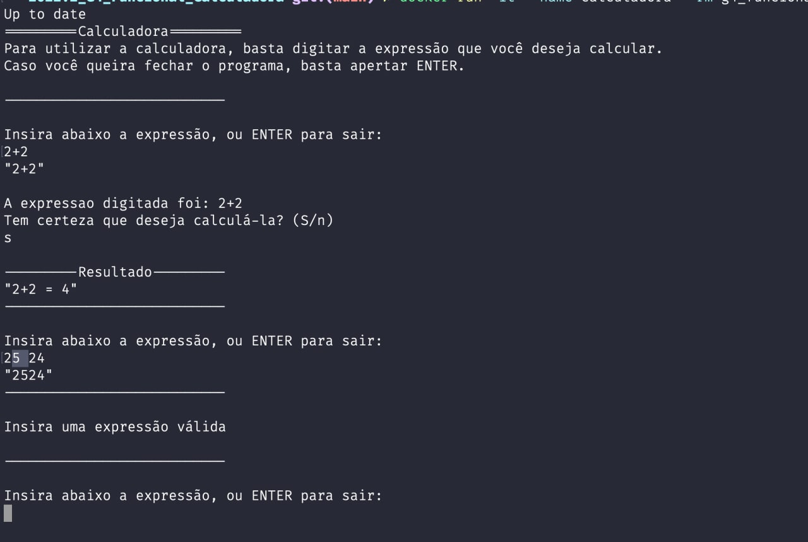
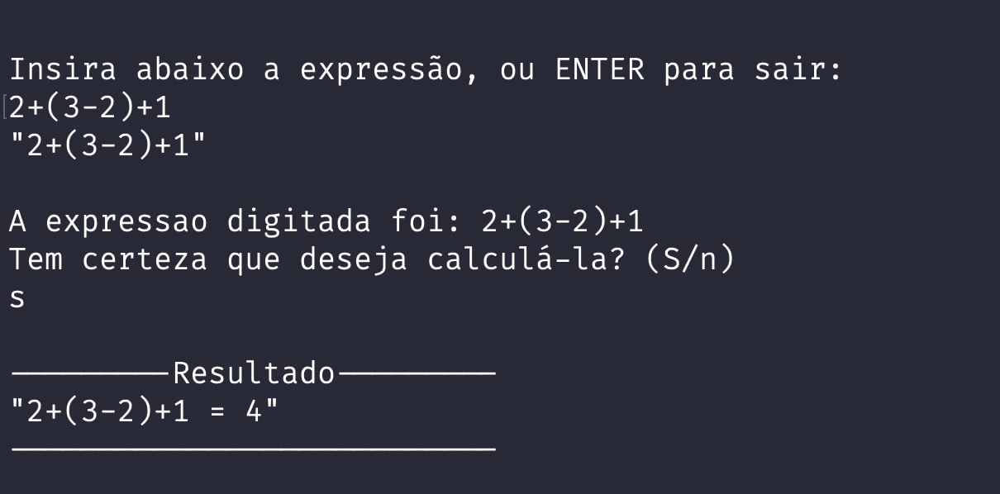

# Calculadora Funcional

**Disciplina**: FGA0210 - PARADIGMAS DE PROGRAMAÇÃO - T01 <br>
**Nro do Grupo**: 04<br>
**Paradigma**: Funcional<br>

## Alunos
| Matrícula  | Aluno                                    |
| ---------- | ---------------------------------------- |
| 19/0124997 | Amanda Jeniffer Pereira Nobre            |
| 19/0101792 | Ana Carolina Rodrigues Leite             |
| 17/0101711 | Daniel Barcelos Moreira                  |
| 16/0119006 | Enzo Gabriel Guedes Queiroz Saraiva      |
| 18/0018604 | Hugo Sobral de Lima Salomão              |
| 18/0102711 | Jaime Juan de Castro Feliciano Damasceno |
| 18/0021974 | Leonardo da Silva Gomes                  |
| 17/0111288 | Micaella Lorraine Gouveia de Lima        |

## Sobre 
O projeto consiste em uma calculadora funcional que tem a capacidade de ler expressões matemáticas e imprimir o resultado via terminal.
Embora seu funcionamento pareça simples, a implementação desta aplicação se assemelha muito mais a um analisador léxico, dando a oportunidade de fazer a leitura de uma string como expressão, e realizar as devidas operações com as prioridades matemáticas respeitadas.

A calculadora abrange as seguintes expressões:
- Adição
- Subtração
- Multiplicação
- Divisão
- Exponencial
- Raiz Quadrada

A calculadora atende os seguintes casos de prioridade de operação:


## Screenshots



## Instalação 
**Linguagens**: Haskell<br>
**Tecnologias**: Haskell Tool Stack e Cabal em ambiente containerizado por Docker<br>

Este projeto conta como dependências as ferramentas [Stack](https://docs.haskellstack.org/en/stable/) e [Cabal](https://cabal.readthedocs.io/en/stable/) providas pela própia linguagem em conjunto com o [GHCup](https://www.haskell.org/ghcup/).

Entretanto, existe uma certa incerteza entre plataformas, visto que o suporte à estas ferramentas não são uniformes entre diferentes sistemas operacionais. Para tal, foi desenvolvido então uma imagem para executar o projeto.

Para executar o projeto, é preciso ter o [Docker](https://docs.docker.com/) instalado localmente, caso você não ainda não tenha, baste seguir a [documentação de instalação da ferramenta](https://docs.docker.com/).

Com o docker instalado, basta executar o seguinte comando em um terminal, localizado na mesma pasta que o arquivo `Dockerfile`:

```
docker build -t g4_funcional_calculadora .
```

Uma vez executado o comando de `build`, é necessário então instanciar um container a partir da imagem. É possível realizar isso com o comando:

```
docker run -it --name calculadora g4_funcional_calculadora
```

Para executar o container parado, então, basta executar o seguinte comando:

```
docker start -a calculadora
```

> Gifs animados e outras ilustrações são bem-vindos!

## Uso 
Após rodar o docker com o comando

```
docker start -a calculadora
```

A calculadora será iniciada, sendo possível já escrever suas expressões para serem calculadas :) 


## Vídeo
[Link do vídeo no youtube](https://youtu.be/kEsykn0DmYA)

## Participações
| Nome do Membro | Contribuição | Significância da Contribuição para o Projeto (Excelente/Boa/Regular/Ruim/Nula) |
| - | - | - |
| Amanda Jeniffer Pereira Nobre | Desenvolvimento da operação de exponencial | Boa |
| Ana Carolina Rodrigues Leite | Desenvolvimento da operação de raiz quadrada | Regular |
| Daniel Barcelos Moreira | Verificação léxica e parte da verificação sintática da expressão | Boa |
| Enzo Gabriel Guedes Queiroz Saraiva | Verificação léxica e parte da verificação sintática da expressão, desacoplamento da operação de recuperar os números da expressão | Regular |
| Hugo Sobral de Lima Salomão | Dockerização, estruturação do projeto, desenvolvimento da subtração, divisão, multiplicação e auxílio na criação das outras operações, refatoração do código para modularização | Excelente |
| Jaime Juan de Castro Feliciano Damasceno | Desenvolvimento da operação de exponencial | Regular |
| Leonardo da Silva Gomes | Desenvolvimento do parser, casts, soma, divisão, multiplicação e auxílio na criação das outras operações, refatoração do código para modularização | Excelente |
| Micaella Lorraine Gouveia de Lima | Desenvolvimento da interface com usuário e tratamento de parênteses, refatoração do código para modularização | Excelente |

## Outros 

### Lições Aprendidas
- A maior lição aprendida foi lidar com recursividade. Não apenas criar funções recursivas, mas pensar na estrutura da solução recursivamente. Foi um grande desafio lidar, necessariamente, com recursividade em problemas que estamos condicionados a resolver de maneira procedural.

- Propagar informações a partir de variáveis imutáveis. Em haskell, um conceito fortemente utilizado é o de funções puras, isto é, não é possível ter mutabilidade nos estados das funções. Isso implica em modificar a forma da manipulação da informação para que esta se adeque ao conceito das funções puras. 

- Como lidamos com o tratamento das strings para interpretar as expressões matemáticas, o grupo adquiriu um conhecimento bastante relevante na análise sintática das expressões.

### Percepções
Durante o planejamento e desenvolvimento do projeto foi observada uma dificuldade do grupo com a linguagem Haskell. O tema foi definido por todos os membros, e a maior motivação foi a possibilidade de escalar a dificuldade do projeto conforme o grupo fosse dominando a nova linguagem. 

No início do desenvolvimento e ao decorrer dos dias, alguns alunos tiveram mais facilidade com a linguagem e conseguiram iniciar o projeto. O que foi notado é que, na semana de desenvolvimento, os outros alunos conseguiram recorrer aos alunos com mais entendimento para realização de pareamentos, aumentando o nível de entendimento e contribuição de cada membro.

### Trabalhos Futuros
1. Exponencial de exponencial
2. API
3. Tratamento de colchetes e chaves


## Fontes
Aqui estão listadas as fontes ou links relevantes utilizados para a codificação do projeto.

> https://www.tutorialspoint.com/haskell/haskell_functions.htm. Acesso em 21/11/2022.
> https://github.com/JudsonSS/Compiladores Acesso em 19/11/2022.  
> https://www.youtube.com/watch?v=nckWiHmeNXU Acesso em 19/11/2022.  
> https://hackage.haskell.org/package/base-4.17.0.0/docs/Data-Char.html Acesso em 22/11/2022.     
> https://hub.docker.com/_/haskell Acesso em 19/11/2022.      
> https://hackage.haskell.org/package/base-4.17.0.0/docs/System-Exit.html Acesso em 23/11/2022.
> https://stackoverflow.com/questions/25457287/couldnt-match-type-maybe-with-io-expected-type-io-string-actual-type-may Acesso em 23/11/2022.  
> https://stackoverflow.com/questions/48177824/how-does-return-statement-work-in-haskell Acesso em 23/11/2022.
